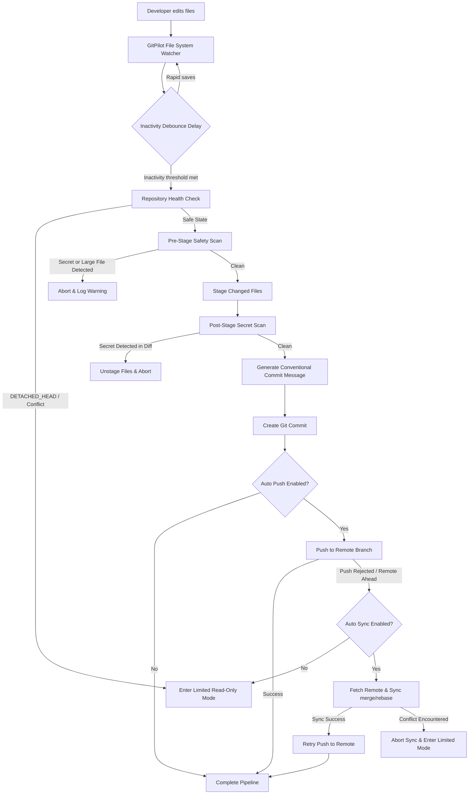
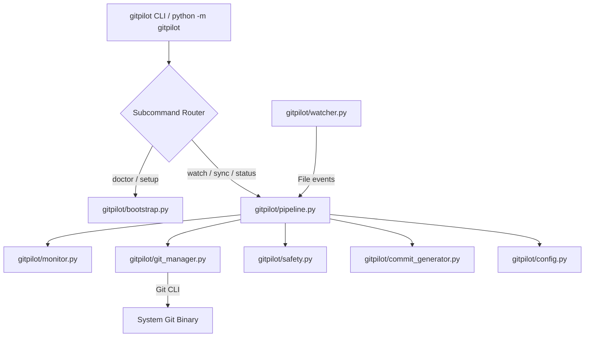

# GitPilot V1.2

> A safety-first Git automation CLI that watches your repository, intelligently groups changes, creates meaningful commits, synchronizes with remote changes, and safely pushes your work.

[](https://www.python.org/)
[](https://github.com/Preetdudhat03/GitPilot)
[](https://github.com/Preetdudhat03/GitPilot)
[](pyproject.toml)

**Repository**: [https://github.com/Preetdudhat03/GitPilot](https://github.com/Preetdudhat03/GitPilot)

---

## Table of Contents
- [The Problem](#the-problem)
- [Core Workflow](#core-workflow)
- [Key Features](#key-features)
- [Installation & Setup](#installation--setup)
- [Using GitPilot on Restricted or College PCs](#using-gitpilot-on-restricted-or-college-pcs)
- [Environment Diagnostics (`gitpilot doctor`)](#environment-diagnostics-gitpilot-doctor)
- [Environment Bootstrap & Recovery (`gitpilot setup`)](#environment-bootstrap--recovery-gitpilot-setup)
- [Python Module Mode (`python -m gitpilot`)](#python-module-mode-python--m-gitpilot)
- [Quick Start](#quick-start)
- [Comprehensive Command Reference](#comprehensive-command-reference)
- [Configuration Reference (`gitpilot.json`)](#configuration-reference-gitpilotjson)
- [Safety by Design](#safety-by-design)
- [System Architecture](#system-architecture)
- [Project Directory Structure](#project-directory-structure)
- [Educational & Portfolio Documentation](#educational--portfolio-documentation)
- [Automated Testing Suite](#automated-testing-suite)
- [Audit & Verification Records](#audit--verification-records)
- [Version History](#version-history)
- [Roadmap](#roadmap)
- [Author & License](#author--license)

---

## The Problem

During active software development, engineers repeatedly execute manual Git commands:

```bash
git add .
git commit -m "update code"
git push origin main
```

This manual cycle introduces several friction points:
1. **Repetitive Friction**: Constant context switching between editor and terminal to run identical Git commands.
2. **Poor Commit Hygiene**: Developers frequently write vague, hasty commit messages or delay committing for hours, producing massive unreviewable diffs.
3. **Forgotten Work**: Code remains uncommitted locally, risking data loss during system crashes or hardware switches.
4. **Push Rejections**: Pushing is rejected when team members push upstream changes, forcing manual fetch, merge, and retry steps.
5. **Accidental Credential Leaks**: Developers accidentally stage `.env` files, API keys, private keys, or massive binary files.
6. **Environment & PATH Restrictions**: Operating on managed lab, enterprise, or college PCs frequently fails due to missing executable PATH entries or restricted administrator permissions.

**GitPilot** resolves these challenges by running a safe, background watcher that automatically groups saves, enforces strict safety scanning, generates conventional commit messages, handles remote synchronization, and provides one-command environment recovery without requiring administrator elevation.

---

## Core Workflow



---

## Key Features

### 1. Automatic File System Watching
Uses `watchdog` to monitor directory events in real time. Listens for file creations, modifications, and deletions while ignoring build artifacts, `.git/` metadata, and configured ignore patterns.

### 2. Smart Inactivity Debouncing
Prevents commit spam. When you save a file 10 times in 30 seconds, GitPilot resets its inactivity timer (`delay`, default `120s`). It only triggers the commit pipeline after you stop typing.

### 3. Conventional Commit Generation
Analyzes file diffs and automatically generates structured Conventional Commit messages (`feat:`, `fix:`, `docs:`, `refactor:`, `style:`, `test:`, `chore:`).

### 4. Multi-Layer Safety Engine (`gitpilot/safety.py`)
- **Sensitive Filename Scan**: Blocks staging of sensitive files (`.env`, `id_rsa`, `*.pem`, `*.key`, `credentials.json`, `client_secret.json`, `*.pkcs12`, `*.pfx`).
- **Diff Secret Pattern Scan**: Scans staged diffs for AWS access keys (`AKIA...`), RSA private keys, Slack tokens, and GitHub personal access tokens.
- **Large File Protection**: Rejects files exceeding `max_file_size_mb` (default `50MB`).
- **Post-Stage Rollback**: If a secret is detected after staging, GitPilot automatically unstages the files to protect the workspace.

### 5. Intelligent Auto Sync (`gitpilot/pipeline.py`)
- **Automatic Remote Synchronization**: When `auto_sync` is enabled, GitPilot fetches and synchronizes changes using your chosen strategy (`merge` or `rebase`) on startup and when a push is rejected due to remote-ahead commits.
- **Safe Abort & State Restoration**: If a rebase or merge conflict occurs during synchronization, GitPilot aborts the sync operation, restores your local branch state, and pauses automatic commits.

### 6. Repository Health State Machine (`gitpilot/status.py`)
Evaluates 9 distinct repository states:
`UP_TO_DATE`, `BEHIND_REMOTE`, `AHEAD_REMOTE`, `DIVERGED`, `MERGING`, `REBASING`, `CONFLICT`, `DETACHED_HEAD`, `UNKNOWN`.

### 7. Centralized `RepositoryMonitor` (`gitpilot/monitor.py`)
Provides status caching, idle detection, debounced updates, telemetry tracking (`last_fetch`, `last_status_refresh`, `last_sync`, `last_push`), and event notifications.

### 8. Limited / Read-Only Watcher Mode
If a repository is behind remote, in a conflict state, or in `DETACHED_HEAD`, GitPilot enters **Limited Mode**. It continues watching your files and displaying notifications, but pauses automatic commits and pushes until synchronization completes.

### 9. Developer Dashboard (`gitpilot status`)
Displays repository health, branch tracking, telemetry timestamps, lock states, auto-push/sync flags, and uncommitted change counts.

### 10. Read-Only Environment Doctor (`gitpilot doctor`)
Performs a 100% read-only diagnostic audit of Python, pip, Git, virtualenv, dependencies, executable PATHs, registry settings, and module execution capabilities.

### 11. Environment Bootstrap & Recovery (`gitpilot setup`)
One-command environment setup that installs packages, resolves declared dependencies, and repairs User-level PATHs safely without requesting administrator elevation.

---

## Git Requirements

GitPilot requires Git to be installed and available in your system PATH.

Verify Git installation:
```bash
git --version
```

Configure your Git identity before enabling automatic commits:
```bash
git config --global user.name "Your Name"
git config --global user.email "you@example.com"
```

Verify your environment and Git identity:
```bash
gitpilot doctor
```

> **Note**: GitPilot inspects your effective Git identity (`user.name` and `user.email`) across global, system, or local repository levels. GitPilot **never** automatically installs Git or silently alters your Git configuration.

---

## Installation & Setup

### 1. Clone the Repository
```bash
git clone https://github.com/Preetdudhat03/GitPilot.git
cd GitPilot
```

### 2. Run Automated Environment Setup
Execute setup using Python module mode:
```bash
python -m gitpilot setup
```
This command inspects your Python environment, installs required dependencies, installs GitPilot in user scope (`--user` outside virtualenv, or venv scope inside virtualenv), and repairs your User PATH.

### 3. Verify Health
```bash
gitpilot doctor
```


---

## Using GitPilot on Restricted or College PCs

Managed computers in university labs, college PCs, or corporate workstations frequently enforce administrative security policies that restrict system-wide software installation or persistent system PATH modifications.

### Safety Philosophy
GitPilot **never** attempts to bypass security policies, alter Group Policy, or request administrator elevation (`runas`).

### How GitPilot Operates on Restricted PCs:
1. **User Scope Only**: Package installation targets Current User directories (`--user`) or active virtual environments.
2. **Persistent User PATH Only**: On Windows, PATH modifications update `HKEY_CURRENT_USER\Environment` (`winreg`), leaving system-wide `HKLM` untouched.
3. **Graceful Fallback**: If Windows denies User PATH modification due to system policy, `gitpilot setup` marks installation as **SUCCESS**, reports PATH as **RESTRICTED**, and displays a safe ASCII fallback box:

```text
+--------------------------------------------------------+
| GitPilot is installed successfully                     |
|                                                        |
| PATH modification was restricted by system policy.     |
| GitPilot will NOT request administrator privileges.    |
|                                                        |
| Safe Fallback Command:                                 |
|                                                        |
|     python -m gitpilot watch                           |
|                                                        |
| All GitPilot commands can be run via python -m module. |
+--------------------------------------------------------+
```

You can execute all GitPilot commands on restricted PCs using:
```bash
python -m gitpilot <command>
```

---

## Environment Diagnostics (`gitpilot doctor`)

The `gitpilot doctor` command is completely **read-only**. It checks environment health without modifying files, PATHs, registry keys, or packages.

### Usage
```bash
gitpilot doctor
# or
python -m gitpilot doctor
```

### Example Diagnostic Output
```text
=== GitPilot Environment Doctor ===

Python
[OK] Python 3.13.1
[OK] Python executable: C:\Users\User\AppData\Local\Programs\Python\Python313\python.exe

pip
[OK] pip 26.1.1

Git
[OK] Git detected
[OK] Version: 2.42.0.windows.2
[OK] Executable: C:\Program Files\Git\cmd\git.EXE

Git Identity
[OK] user.name: Preet Dudhat
[OK] user.email: preet@example.com
[OK] Source: global

GitPilot
[OK] Package installed (1.2.0)
[OK] Dependencies available (watchdog 6.0.0)
[OK] CLI available (C:\Users\User\AppData\Local\Programs\Python\Python313\Scripts\gitpilot.EXE)

Environment
[OK] PATH (Available in PATH)
[OK] Module execution (python -m gitpilot working)

Overall Status: HEALTHY
```


---

## Environment Bootstrap & Recovery (`gitpilot setup`)

`gitpilot setup` diagnoses, installs, and repairs your GitPilot setup idempotently.

### Usage
```bash
gitpilot setup [flags]
# or
python -m gitpilot setup [flags]
```

### Flags
- `--dry-run`: Inspects environment and logs `[WOULD CHANGE]` actions without modifying anything.
- `--verbose` / `-v`: Displays detailed diagnostic paths and traceback information.
- `--repair`: Re-attempts safe user-level repairs for missing PATH entries or broken installations.

---

## Python Module Mode (`python -m gitpilot`)

When the `gitpilot` executable is missing from your terminal PATH, all CLI subcommands can be executed via Python module mode:

```bash
python -m gitpilot doctor
python -m gitpilot setup
python -m gitpilot init
python -m gitpilot watch
python -m gitpilot status
python -m gitpilot sync
python -m gitpilot commit
python -m gitpilot push
python -m gitpilot config <key> [value]
```

Module execution delegates directly to `gitpilot.cli.main()`, providing 100% feature parity with the CLI executable.

---

## Quick Start

```bash
# 1. Clone & Setup GitPilot
git clone https://github.com/Preetdudhat03/GitPilot.git
cd GitPilot
python -m gitpilot setup

# 2. Navigate to your project repository
cd ../my-project

# 3. Initialize GitPilot configuration
gitpilot init

# 4. Enable Auto Sync (optional)
gitpilot config auto_sync true
gitpilot config sync_strategy merge

# 5. Start background watcher
gitpilot watch

# 6. Open a new terminal to view status dashboard anytime
gitpilot status
```

---

## Comprehensive Command Reference

| Command | Usage | Description |
|---|---|---|
| **`doctor`** | `gitpilot doctor` | Displays read-only environment diagnostics without modifying system state. |
| **`setup`** | `gitpilot setup [--dry-run] [--repair]` | Bootstraps, installs, or repairs environment, dependencies, and User PATH. |
| **`init`** | `gitpilot init` | Initializes default `gitpilot.json` in the current repository root. |
| **`watch`** | `gitpilot watch [--dry-run]` | Starts background watcher with Automatic Initial Synchronization. |
| **`status`** | `gitpilot status` | Displays rich developer status dashboard and telemetry. |
| **`sync`** | `gitpilot sync` | Manually triggers repository synchronization with remote (`merge`/`rebase`). |
| **`commit`** | `gitpilot commit [--push]` | Manually triggers safe commit pipeline once. |
| **`push`** | `gitpilot push` | Pushes local commits to configured remote branch. |
| **`config`** | `gitpilot config <key> [value]` | Gets or sets configuration key in `gitpilot.json`. |

---

## Configuration Reference (`gitpilot.json`)

```json
{
  "branch": "main",
  "remote": "origin",
  "watch": true,
  "delay": 120,
  "auto_push": false,
  "auto_sync": false,
  "sync_strategy": "merge",
  "fetch_interval": 300,
  "max_file_size_mb": 50
}
```

### Configuration Options
| Key | Type | Default | Description |
|---|---|---|---|
| `branch` | string | `"main"` | Default target branch name. |
| `remote` | string | `"origin"` | Default target remote name. |
| `watch` | boolean | `true` | Global watcher activation flag (`true`/`false`). |
| `delay` | integer | `120` | Inactivity delay in seconds before committing (min: 1). |
| `auto_push` | boolean | `false` | Automatically push to remote after committing (`true`/`false`). |
| `auto_sync` | boolean | `false` | Automatically fetch & sync when behind or push rejected (`true`/`false`). |
| `sync_strategy` | string | `"merge"` | Auto Sync strategy (`"merge"` or `"rebase"`). |
| `fetch_interval` | integer | `300` | Background fetch interval in seconds (`0` to disable). |
| `max_file_size_mb` | integer | `50` | Maximum file size in MB allowed to be staged. |

---

## Safety by Design

GitPilot is engineered with strict safety constraints to protect developer workspaces:

- **No Destructive Overwrites**: GitPilot **never** executes `git push --force`, `git push --force-with-lease`, or `git reset --hard`.
- **Pre-Stage Protection**: Blocks sensitive filenames and files exceeding `max_file_size_mb`.
- **Post-Stage Rollback**: If a secret pattern (AWS key, RSA key, Slack token, GitHub token) is detected in a staged diff, GitPilot automatically unstages the files.
- **Conflict Isolation**: Aborts sync operations upon merge or rebase conflicts, restoring local repository state and switching the watcher to Limited Mode.
- **Pipeline Locking**: Uses threading locks (`threading.Lock`) to prevent concurrent pipeline executions.

---

## System Architecture



### Module Responsibilities
- `gitpilot/cli.py`: Argument parsing and command dispatch.
- `gitpilot/bootstrap.py`: Read-only `EnvironmentInspector` and idempotent `BootstrapManager`.
- `gitpilot/pipeline.py`: Core pipeline orchestration (`run`, `synchronize`, `evaluate_startup`).
- `gitpilot/monitor.py`: Centralized status caching, background fetch, and telemetry tracking.
- `gitpilot/git_manager.py`: Low-level Git command execution and status classification.
- `gitpilot/watcher.py`: File system event handler with debouncing logic.
- `gitpilot/safety.py`: Pre/post stage credential scanning and file size checks.
- `gitpilot/commit_generator.py`: Rule-based Conventional Commit generator.
- `gitpilot/config.py`: JSON configuration loading, validation, and saving.
- `gitpilot/status.py`: Data models (`RepositoryState`, `RepositoryStatus`, `SyncResult`).

---

## Project Directory Structure

```text
GitPilot/
├── pyproject.toml               # Package declaration & project metadata
├── README.md                    # Project documentation
├── SETUP_AUDIT.md               # Environment bootstrap audit report
├── AUTO_SYNC_AUDIT.md           # Auto sync system verification report
├── FINAL_AUDIT.md               # Core pipeline audit report
├── TESTING.md                   # Testing strategy documentation
├── explanations/
│   └── bootstrap_explanation.md # Detailed educational system guide
├── gitpilot/
│   ├── __init__.py
│   ├── __main__.py              # Python module entry point
│   ├── bootstrap.py             # Environment bootstrap & doctor
│   ├── cli.py                   # Command line interface
│   ├── commit_generator.py     # Conventional commit rules
│   ├── config.py                # Configuration manager
│   ├── git_manager.py           # Git CLI interaction
│   ├── logger.py                # Logging setup
│   ├── monitor.py               # Repository monitor & telemetry
│   ├── pipeline.py              # GitPilot execution pipeline
│   ├── safety.py                # Secret & safety scanner
│   ├── status.py                # State & status data models
│   └── watcher.py               # File system watcher
└── tests/                       # Automated test suite (64 tests)
```

---

## Educational & Portfolio Documentation

GitPilot is designed as an educational reference architecture for Python CLI engineering. Deep-dive explanations are available in the [`explanations/`](explanations/) directory:

- [`explanations/bootstrap_explanation.md`](explanations/bootstrap_explanation.md): Line-by-line guide on Python environment detection, `sysconfig`, `tomllib` TOML parsing, Windows registry `winreg` interactions, and restricted environment fallback design.
- [`AUTO_SYNC_AUDIT.md`](AUTO_SYNC_AUDIT.md): Comprehensive guide on Git synchronization state machines, fetch locking, and rebase restoration.

Key concepts demonstrated in the codebase:
- Real-time file system event watching (`watchdog`).
- Concurrency control and thread safety (`threading.Lock`).
- Windows Registry API programming (`winreg`).
- Standard library TOML parsing (`tomllib`).
- Subprocess management and exit code error handling.

---

## Automated Testing Suite

GitPilot includes a comprehensive test suite built with Python's standard `unittest` framework and `pytest`.

### Running Tests
```bash
python -m pytest tests
```
or
```bash
python -m unittest discover -s tests -v
```

### Verified Test Results
```text
============================= 64 passed in 4.22s ==============================
```

- **Total Tests**: 64
- **Passed**: 64
- **Failed**: 0
- **Skipped**: 0

---

## Audit & Verification Records

GitPilot undergoes formal technical audits documented in root Markdown files:
- [`SETUP_AUDIT.md`](SETUP_AUDIT.md): Environment bootstrap audit, security restrictions, manual test matrix, and acceptance criteria verification.
- [`AUTO_SYNC_AUDIT.md`](AUTO_SYNC_AUDIT.md): Verification of startup synchronization and conflict handling.
- [`FINAL_AUDIT.md`](FINAL_AUDIT.md): Core pipeline safety and telemetry verification.

---

## Version History

### V1.0
- Initial Git automation pipeline.
- Background file system watcher with smart inactivity debouncing.
- Conventional commit message generation.
- Pre-stage and post-stage secret scanning.

### V1.1
- Intelligent Auto Sync (`merge` & `rebase` strategies).
- Automatic startup synchronization check.
- Repository health state machine (`9` distinct states).
- Centralized `RepositoryMonitor` with background fetch and telemetry.
- Limited / Read-Only watcher mode.

### V1.2
- Read-only environment diagnostic command (`gitpilot doctor`).
- Environment bootstrap & recovery manager (`gitpilot setup`).
- Standard library `tomllib` TOML document dependency resolution.
- Restricted PC handling with ASCII fallback box.
- Python module execution support (`python -m gitpilot`).

---

## Roadmap

Planned future enhancements:
- **Plugin Hooks**: Custom pre-commit and post-sync script hooks.
- **Git Worktree Support**: Enhanced monitoring for multi-worktree repositories.
- **Desktop Notifications**: Cross-platform system notifications for state changes.

---

## Author & License

- **Author**: Preet Dudhat
- **GitHub**: [https://github.com/Preetdudhat03/GitPilot](https://github.com/Preetdudhat03/GitPilot)
- **License**: MIT License (declared in `pyproject.toml`)
